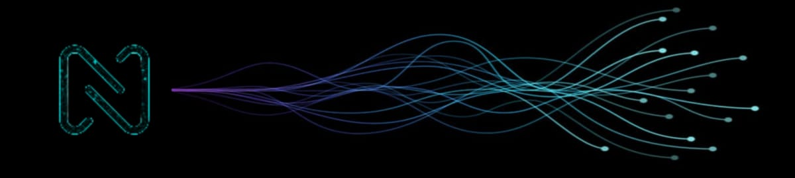

# I'm Nishant Singh    

### Aspiring Data Scientist | Machine Learning Enthusiast | Open-Source Contributor
I am a dedicated AI developer with a deep focus on building machine learning and deep learning models from scratch. My expertise spans RNNs, computer vision, and transformer architectures, where I specialize in designing custom solutions to optimize model accuracy and efficiency. I have hands-on experience with training and fine-tuning advanced models, including BERT, YOLO, ResNet, and VGG, while ensuring that architectures and parameters are tailored to meet project-specific goals. My work ranges from image segmentation and object detection to developing language models, always with an eye on integrating the latest AI advancements.

I am passionate about driving innovation through AI and constantly refining techniques to push the boundaries of performance. Explore my projects and contributions further on my portfolio.  __Click below:__

Talk with me: <a href="mailto:nishantsingh.talk@gmail.com" target="_blank"> NishantSingh.talk</a>
